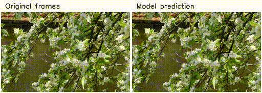

# Generative Image Dynamics — Gaussian vs Softmax Splatting (Machine Vision Final Project)

This repository contains our implementation and experimental analysis for the **Machine Vision Final Project**, where we extend the *Generative Image Dynamics* pipeline by replacing Softmax Splatting with **Gaussian Splatting** for motion-based image animation.

The base system is adapted from:

* **[1]** Zhengqi Li, Richard Tucker, Noah Snavely, Aleksander Holynski. *Generative Image Dynamics*. CVPR 2024.
* **[2]** Simon Niklaus, Feng Liu. *Softmax Splatting for Video Frame Interpolation*. CVPR 2020.

Our goal was to **replicate the motion synthesis + frame generation pipeline**, substitute Gaussian Splatting for Softmax Splatting, and compare **quantitative and qualitative** results.

---

## 🚀 Project Overview

The original pipeline performs two core tasks:

### **1. Motion Synthesis (Latent Diffusion Model)**  
A diffusion model predicts the **temporal FFT of optical flow** from a single still image.

### **2. Frame Synthesis (Softmax or Gaussian Splatting)**  
Given an image and forward flows, the system renders predicted frames using either Softmax Splatting or our modified Gaussian Splatting approach.

---

# 📦 Dependencies

```
torch==2.3.0
torchvision==0.18.0
diffusers==0.28.0
torchmetrics==1.4.0
opencv-python==4.8.0
scipy==1.11.4
matplotlib==3.7.1
moviepy==1.0.3
cupy==12.2.0
pyflow
```

---

# 🎥 Qualitative Results

### **Softmax Splatting Result**
```
outputs/softmax_result.mp4
```

<h4>Softmax Splatting Result</h4>


### **Gaussian Splatting Result**
```
outputs/gaussian_result.mp4
```

<h4>Gaussian Splatting Result</h4>


---

# 🌀 Motion Synthesis Model

Implemented as a **latent diffusion model (LDM)** consisting of:
- A VAE from `CompVis/ldm-celebahq-256`
- A U-Net trained from scratch  
- FFT-based optical flow conditioning

Training script:
```
python train_unet.py
```

---

# 🔧 Frame Synthesis Model

The frame synthesis module takes:
- Input image  
- Forward flows  

and synthesizes new frames via:

- **Softmax Splatting** (baseline)
- **Gaussian Splatting** (our modification)

Both feed warped multiscale features into a **GridNet**.

---

# 📊 Quantitative Evaluation

Metrics used:
- **PSNR ↑**
- **SSIM ↑**
- **LPIPS ↓**

Dataset:
- 82 sequences  
- 150 frames each  
- 256×160 resolution  
- 30 FPS  

---

# 🛠 Training the Frame Synthesis Models

Softmax Splatting:
```
python train_frame_synthesis_softsplat.py
```

Gaussian Splatting:
```
python train_frame_synthesis_gaussian.py
```

---

# ▶️ Running Inference

### Generate optical flow:
```
python generate_motion.py     --input image.png     --output outputs/flow.npz
```

### Synthesize with Softmax:
```
python synthesize_softmax.py     --image image.png     --flow outputs/flow.npz     --outdir outputs/
```

### Synthesize with Gaussian:
```
python synthesize_gaussian.py     --image image.png     --flow outputs/flow.npz     --outdir outputs/
```

---

# 🗂 Project Structure

```
├── outputs/
│   ├── softmax_result.mp4
│   ├── gaussian_result.mp4
├── train_unet.py
├── train_frame_synthesis_softsplat.py
├── train_frame_synthesis_gaussian.py
├── synthesize_softmax.py
├── synthesize_gaussian.py
└── README.md
```

---

# 📚 References

[1] Z. Li, R. Tucker, N. Snavely, A. Holynski. *Generative Image Dynamics*. CVPR 2024.  
[2] S. Niklaus, F. Liu. *Softmax Splatting*. CVPR 2020.
